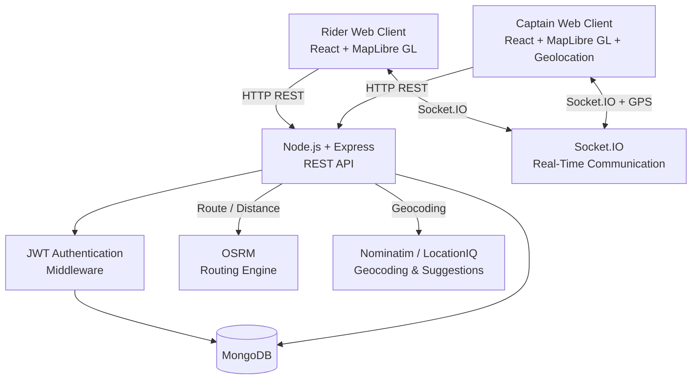
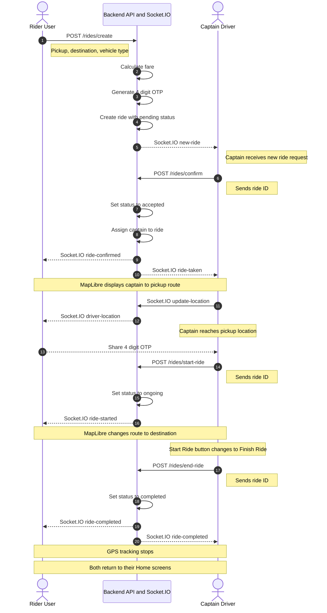

# 🚖 Uber Clone — Full-Stack Real-Time Ride Hailing & Live Navigation Platform

[](https://nodejs.org/)
[](https://expressjs.com/)
[](https://react.dev/)
[](https://vitejs.dev/)
[](https://www.mongodb.com/)
[](https://socket.io/)
[](https://maplibre.org/)
[](https://opensource.org/licenses/ISC)

A full-stack, production-ready real-time ride-hailing web platform inspired by Uber. The application features dual user roles (**Rider/User** and **Captain/Driver**), dynamic fare estimation, real-time ride dispatching via **Socket.IO**, live GPS location streaming, and turn-by-turn road-following map navigation powered by **MapLibre GL JS** and **OSRM (Open Source Routing Machine)**.

---

## 📑 Table of Contents

- [1. Project Title](#-uber-clone--full-stack-real-time-ride-hailing--live-navigation-platform)
- [2. Short Project Description](#2-short-project-description)
- [3. Main Features](#3-main-features)
- [4. Key Functionality & User Flow](#4-key-functionality--user-flow)
- [5. Technology Stack](#5-technology-stack)
- [6. System Architecture](#6-system-architecture)
- [7. Frontend Structure](#7-frontend-structure)
- [8. Backend Structure](#8-backend-structure)
- [9. Real-Time Communication Using Socket.IO](#9-real-time-communication-using-socketio)
- [10. Live Map & Navigation Using MapLibre + OSRM](#10-live-map--navigation-using-maplibre--osrm)
- [11. Authentication & Authorization](#11-authentication--authorization)
- [12. Database Information](#12-database-information)
- [13. API Overview & Endpoints](#13-api-overview--endpoints)
- [14. Ride Lifecycle](#14-ride-lifecycle)
- [15. Project Folder Structure](#15-project-folder-structure)
- [16. Environment Variables](#16-environment-variables)
- [17. Installation & Setup Instructions](#17-installation--setup-instructions)
- [18. How to Run Frontend](#18-how-to-run-frontend)
- [19. How to Run Backend](#19-how-to-run-backend)
- [20. How to Use & Test the Application](#20-how-to-use--test-the-application)
- [21. Deployment Information](#21-deployment-information)
- [22. Screenshots & UI Previews](#22-screenshots--ui-previews)
- [23. Future Improvements](#23-future-improvements)
- [24. Credits & Technologies Used](#24-credits--technologies-used)

---

## 2. Short Project Description

This platform provides a complete end-to-end transportation booking experience. Users can search addresses with live suggestions, calculate distance and multi-vehicle fares (Car, Auto, Moto), request rides, and track their driver live on a road-following vector map. Captains can register vehicles, toggle availability, receive real-time dispatch alerts, accept rides, authenticate passengers via a secure 4-digit OTP, follow live navigation routes, and complete trips.

---

## 3. Main Features

- **Dual Role System**: Separate accounts and flows for **Riders** and **Captains (Drivers)**.
- **Secure Authentication**: JWT-based stateless authentication with password hashing (`bcrypt`), cookie/header parsing, and database-backed token blacklisting on logout.
- **Live Location Autocomplete**: Real-time pickup and destination place suggestions via LocationIQ and OpenStreetMap Nominatim.
- **Dynamic Fare Calculation**: Automatic road-distance and trip-duration calculations using OSRM, computing customized pricing tiers across `Car`, `Auto`, and `Bike/Moto`.
- **Real-Time Ride Dispatch**: Instant notifications pushed to nearby online captains through dedicated Socket.IO rooms.
- **Captain Ride Requests Dashboard**: Interactive page (`/captain-requests`) enabling captains to browse, inspect, and selectively accept pending ride requests.
- **Interactive Animated UI**: Bottom panels and modal transitions powered by **GSAP** (`@gsap/react`).
- **Road-Following Live Navigation**: Map navigation built on **MapLibre GL JS** and **OSRM**, rendering high-fidelity road routes rather than straight lines.
- **Dynamic Two-Phase Routing**:
  - **Phase 1 (Pickup Phase)**: Live route from Captain's current position to Rider's Pickup location.
  - **Phase 2 (In-Trip Phase)**: Automatic switch to Captain/Rider position to Final Destination upon starting the ride.
- **Movement-Based Route Recalculation**: Automatic route updates when the driver moves a meaningful distance ($\ge 40$ meters) or periodically, avoiding continuous unnecessary API polling.
- **Live GPS Tracking**: High-accuracy captain coordinate tracking via the browser's Geolocation API (`watchPosition`) transmitted smoothly through Socket.IO.
- **OTP Verification**: Secure 4-digit one-time passcode generated per ride to verify passenger identity before departure.
- **Single Page App Flow**: Clean transition back to home dashboards for both users upon trip completion without jarring browser reloads.

---

## 4. Key Functionality & User Flow

```mermaid
flowchart LR
    subgraph Rider Flow
        A1[Register / Login] --> A2[Find Trip: Enter Pickup & Destination]
        A2 --> A3[Select Vehicle & View Fares]
        A3 --> A4[Create Ride Request]
        A4 --> A5[Waiting for Captain]
        A5 --> A6[Captain Assigned & Live Map Active]
        A6 --> A7[Share OTP with Captain]
        A7 --> A8[Ride In Progress: En Route to Destination]
        A8 --> A9[Ride Completed: Return to Home]
    end

    subgraph Captain Flow
        B1[Register Vehicle / Login] --> B2[Captain Home / Online Status]
        B2 --> B3[Receive Ride Alert / View Pending Requests]
        B3 --> B4[Accept Ride]
        B4 --> B5[Live Navigation: Captain -> Pickup]
        B5 --> B6[Arrive at Pickup & Verify OTP / Start Ride]
        B6 --> B7[Live Navigation: Captain -> Destination]
        B7 --> B8[Click Finish Ride]
        B8 --> B9[Trip Completed: GPS Stops & Return to Dashboard]
    end

    A4 -.->|Socket.IO: new-ride| B3
    B4 -.->|Socket.IO: ride-confirmed| A6
    B6 -.->|Socket.IO: ride-started| A8
    B8 -.->|Socket.IO: ride-completed| A9
```



---

## 5. Technology Stack

### Frontend
| Technology | Version | Purpose |
| :--- | :--- | :--- |
| **React** | `^19.2.8` | Component-based UI library |
| **Vite** | `^8.2.2` | High-performance build tool and dev server |
| **React Router DOM** | `^7.18.3` | Client-side routing and protected routes |
| **MapLibre GL JS** | `^6.11.2` | WebGL-powered interactive road vector maps |
| **Socket.IO Client** | `^4.8.3` | Real-time WebSocket connection to backend |
| **GSAP & @gsap/react** | `^3.15.0` | Production animation engine for bottom panels |
| **Tailwind CSS** | `^4.3.3` | Utility-first CSS framework |
| **Axios** | `^1.20.0` | Promise-based HTTP client for REST APIs |
| **Remixicon** | `^4.9.1` | Icon system across passenger and driver UI |

### Backend
| Technology | Version | Purpose |
| :--- | :--- | :--- |
| **Node.js** | `>= 18` | Server-side JavaScript runtime |
| **Express.js** | `^5.2.1` | Web framework for REST endpoints |
| **MongoDB & Mongoose** | `^9.9.2` | NoSQL document database and ODM modeling |
| **Socket.IO** | `^4.8.1` | Real-time bi-directional event communication |
| **JSONWebToken (JWT)** | `^9.0.3` | Stateless bearer token authentication |
| **bcrypt** | `^6.0.0` | Salted cryptographic password hashing |
| **express-validator** | `^7.3.2` | Schema-based request payload validation |
| **cookie-parser** | `^1.4.7` | Cookie header extraction |
| **cors** | `^2.8.6` | Cross-Origin Resource Sharing enablement |
| **dotenv** | `^17.4.2` | Environment configuration management |
| **nodemon** | `^3.1.14` | Development auto-reload server utility |

### External Mapping & Geospatial Services
- **OSRM (Open Source Routing Machine)**: Driving distance, trip duration, and road-following GeoJSON coordinates (`https://router.project-osrm.org/`).
- **OpenStreetMap (Nominatim)**: Free geocoding lookup for coordinate resolution (`https://nominatim.openstreetmap.org/search`).
- **OpenStreetMap Standard Tile Server**: Map tile rendering layer (`https://{s}.tile.openstreetmap.org/{z}/{x}/{y}.png`).
- **LocationIQ Autocomplete API**: Typeahead address autocomplete suggestions.

---
## 6. System Architecture




---

## 7. Frontend Structure

The frontend is arranged under `frontend/src/` into modular directories:

```
frontend/src/
├── assets/                  # Static images and logo assets
├── components/              # Reusable UI & Live Map components
│   ├── CaptainDetails.jsx   # Captain profile summary (earnings, hours, status)
│   ├── ConfirmRide.jsx      # Panel to review trip details and confirm ride booking
│   ├── ConfirmRidePopUp.jsx # Modal popup with OTP input for starting trips
│   ├── DriverLocation.jsx   # Background GPS tracker (navigator.geolocation.watchPosition)
│   ├── FinishRide.jsx       # Modal to conclude trip with payment & destination confirmation
│   ├── LiveRideMap.jsx      # MapLibre GL map, markers, OSRM road route layer, and GPS listener
│   ├── LocationSearchPanel.jsx # Dropdown list of address suggestions
│   ├── LookingForDriver.jsx # Animated searching screen while captains are being notified
│   ├── RidePopUp.jsx        # Incoming ride alert card for captains
│   ├── VehiclePanel.jsx     # Vehicle selection sheet (Car, Auto, Moto fares)
│   └── WaitingForDriver.jsx # Passenger bottom sheet with driver details, OTP, and status
├── context/                 # React Context providers for global state
│   ├── CaptainContext.jsx   # Active captain profile and state
│   ├── SocketContext.jsx    # Singleton Socket.IO client instance
│   └── userContext.jsx      # Active user/passenger profile and state
├── pages/                   # Application view routes
│   ├── CaptainHome.jsx      # Captain main screen (live map, pending ride banner, ride controls)
│   ├── CaptainLogin.jsx     # Driver login screen
│   ├── CaptainLogout.jsx    # Driver logout handler
│   ├── CaptainProtectWrapper.jsx # Route protection wrapper for captains
│   ├── CaptainRideRequests.jsx   # Dedicated feed of all pending ride requests
│   ├── CaptainRiding.jsx    # Captain active riding view
│   ├── CaptainSignup.jsx    # Driver & vehicle registration screen
│   ├── Home.jsx             # Rider main screen (search trip, choose vehicle, live map)
│   ├── Riding.jsx           # Passenger riding view
│   ├── Start.jsx            # Splash / welcome landing screen
│   ├── UserLogin.jsx        # Rider login screen
│   ├── UserLogout.jsx       # Rider logout handler
│   ├── UserProtectWrapper.jsx # Route protection wrapper for riders
│   └── UserSignup.jsx       # Rider registration screen
├── App.jsx                  # Main router definitions
├── index.css                # Global Tailwind CSS imports
└── main.jsx                 # React root DOM mounting with Context Providers
```

---

## 8. Backend Structure

The backend is arranged under `backend/` following a clean Controller-Service-Model architecture:

```
backend/
├── controllers/             # Request handling and response formatting
│   ├── captain.controller.js # Captain auth, profile, and logout
│   ├── map.controller.js     # Coordinates, distance-time, suggestions, and routes
│   ├── ride.controller.js    # Ride creation, fare, confirmation, start, and end
│   └── user.controller.js    # User auth, profile, and logout
├── db/                      # Database configuration
│   └── db.js                # Mongoose connection initialization
├── middlewares/             # Express route guards
│   └── auth.middleware.js   # authUser and authCaptain JWT verification
├── models/                  # Mongoose document schemas
│   ├── blacklistToken.model.js # Expired JWT tokens with TTL index
│   ├── captain.model.js     # Captain profile, vehicle specs, and coordinates
│   ├── ride.model.js        # Ride records, OTP, status enum, and fare
│   └── user.model.js        # Rider profile credentials
├── routes/                  # Express route declarations
│   ├── captain.routes.js    # /captains routes
│   ├── map.routes.js        # /maps routes
│   ├── ride.routes.js       # /rides routes
│   └── user.routes.js       # /users routes
├── services/                # Business logic and external API integrations
│   ├── captain.service.js   # Captain creation helper
│   ├── maps.service.js      # Nominatim geocoding, LocationIQ autocomplete, OSRM routing
│   ├── ride.service.js      # Fare calculation formulas, OTP generator, ride state transitions
│   └── user.services.js     # User creation helper
├── app.js                   # Express app setup, CORS, JSON parsing, routes mounting
├── server.js                # HTTP server and Socket.IO initialization
└── socket.js                # Real-time WebSocket connection handling and room messaging
```

---

## 9. Real-Time Communication Using Socket.IO

The application implements real-time messaging through `backend/socket.js` and `frontend/src/context/SocketContext.jsx`. Clients join role-based and ride-specific rooms.

### Socket.IO Event Reference Table

| Event Name | Direction | Payload | Scope / Room | Description |
| :--- | :--- | :--- | :--- | :--- |
| `join` | Client $\rightarrow$ Server | `{ userId, userType, rideId? }` | Global | Associates socket ID with User/Captain in MongoDB; joins `user_{id}`, `captain_{id}`, and `captains`. |
| `join-ride` | Client $\rightarrow$ Server | `{ rideId }` | `ride:${rideId}` | Joins a synchronized room dedicated to an active ride. |
| `update-location` | Captain $\rightarrow$ Server | `{ rideId, location: { lat, lng } }` | `ride:${rideId}` | Captain broadcasts live GPS coordinates to the ride room. |
| `driver-location` | Server $\rightarrow$ Client | `{ lat, lng }` | `ride:${rideId}` | Received by Rider and Captain to smoothly update the car marker on the map. |
| `update-location-captain`| Captain $\rightarrow$ Server | `{ userId, location: { lat, long } }` | Database | Persists captain's current position to MongoDB. |
| `new-ride` | Server $\rightarrow$ Captains | `Ride Object` | `captains` room & broadcast | Notifies online captains of a new pending ride request. |
| `ride-taken` | Server $\rightarrow$ Captains | `{ rideId }` | `captains` room | Informs other captains that a ride has been accepted by someone else. |
| `ride-confirmed` | Server $\rightarrow$ Rider | `Ride Object` | `user_{userId}` & broadcast | Notifies rider that a captain accepted the ride and assigns the driver. |
| `ride-started` | Server $\rightarrow$ Ride Room | `Ride Object` | `ride:${rideId}` & user room | Signals that trip has begun; switches route to destination. |
| `ride-completed` | Server $\rightarrow$ Ride Room | `Ride Object` | `ride:${rideId}` & user room | Signals trip completion; triggers teardown and returns users to home. |
| `ride-ended` | Server $\rightarrow$ Ride Room | `Ride Object` | `ride:${rideId}` & user room | Alias/backup event for ride completion. |
| `disconnect` | Client $\rightarrow$ Server | — | Global | Clears stored `socketId` references in MongoDB. |

---

## 10. Live Map & Navigation Using MapLibre + OSRM

The live map is implemented in `frontend/src/components/LiveRideMap.jsx`:

1. **Free Tile Rendering**: Utilizes **MapLibre GL JS** with OpenStreetMap raster tiles, completely eliminating proprietary mapping API key dependencies.
2. **Marker Management**:
   - **Captain Marker**: Black circular badge with a white car icon (`ri-car-fill`). Positioned and updated live via `marker.setLngLat([lng, lat])` without recreating the map instance.
   - **Pickup Marker**: Green circular badge with a user pin icon (`ri-map-pin-user-fill`).
   - **Destination Marker**: Red circular badge with a destination pin icon (`ri-map-pin-2-fill`).
3. **Road-Following Geometry**:
   - Queries OSRM via `GET /maps/get-route` or direct OSRM endpoint with:
     ```
     https://router.project-osrm.org/route/v1/driving/{startLng},{startLat};{endLng},{endLat}?overview=full&geometries=geojson&steps=true
     ```
   - Renders a multi-layered road line using MapLibre's GeoJSON source:
     - `osrm-route-casing`: 7px slate line (`#1e293b`) with 35% opacity for depth and contrast.
     - `osrm-route-layer`: 4.5px solid dark line (`#000000`) tracing real street curvatures.
4. **Dynamic Route Phases**:
   - **Before Ride Starts**: Route is drawn from `[Captain Coords] -> [Pickup Coords]`.
   - **After Ride Starts**: Route automatically recalculates from `[Captain Coords] -> [Destination Coords]`.
5. **Smart Movement Throttling**:
   - Recalculates OSRM road geometry only after the captain moves $\ge 40$ meters (calculated via the Haversine formula) with at least a 5-second interval, or periodically every 25 seconds if moving.
   - Updates the existing GeoJSON source via `existingSource.setData(...)` rather than duplicating layers.
   - Preserves user camera zoom during in-trip movement without jarring view resets.

---

## 11. Authentication & Authorization

Authentication is uniform across both User and Captain accounts:

- **Password Security**: Passwords are encrypted before persisting to MongoDB using `bcrypt` (10 salt rounds). Schema configurations set `select: false` to avoid exposing password hashes in query results.
- **JWT Tokens**:
  - Signed using `process.env.JWT_SECRET` with a 24-hour expiration (`expiresIn: "24h"`).
  - Delivered via response payloads and can be set in HTTP cookies (`token`).
- **Authorization Guard**:
  - `authMiddleware.authUser`: Validates token, checks against `blacklistToken` collection, and attaches `req.user`.
  - `authMiddleware.authCaptain`: Validates token, checks blacklist, and attaches `req.captain`.
- **Token Invalidation on Logout**:
  - When `/users/logout` or `/captains/logout` is requested, the current JWT token is saved into the `blacklistToken` collection.
  - The `blacklistToken` collection contains a MongoDB TTL index that automatically deletes documents after 24 hours (`expires: 86400`).
- **Client Route Guards**:
  - `UserProtectWrapper.jsx` redirects unauthenticated visitors to `/login`.
  - `CaptainProtectWrapper.jsx` redirects unauthenticated drivers to `/captain-login`.

---

## 12. Database Information

The application utilizes **MongoDB** via **Mongoose**.

### 1. `users` Collection
| Field | Type | Attributes | Description |
| :--- | :--- | :--- | :--- |
| `fullname.firstname` | String | Required, Min 3 chars | User's first name |
| `fullname.lastname` | String | Optional, Min 3 chars | User's last name |
| `email` | String | Required, Unique | Email address |
| `password` | String | Required, `select: false` | Hashed password |
| `socketId` | String | Optional | Current active WebSocket ID |

### 2. `captains` Collection
| Field | Type | Attributes | Description |
| :--- | :--- | :--- | :--- |
| `fullname.firstname` | String | Required, Min 3 chars | Captain's first name |
| `fullname.lastname` | String | Optional | Captain's last name |
| `email` | String | Required, Regex match | Email address |
| `password` | String | Required, `select: false` | Hashed password |
| `socketId` | String | Optional | Current active WebSocket ID |
| `status` | String | Enum: `['active', 'inactive']` | Captain online/offline state |
| `vehicle.color` | String | Required | Vehicle color |
| `vehicle.plate` | String | Required | Vehicle registration plate number |
| `vehicle.capacity` | Number | Required, Min 1 | Passenger seating capacity |
| `vehicle.vehicleType` | String | Enum: `['car', 'bike', 'auto', 'truck']` | Type of vehicle |
| `location.lat` | Number | Optional | Last recorded latitude |
| `location.long` | Number | Optional | Last recorded longitude |

### 3. `rides` Collection
| Field | Type | Attributes | Description |
| :--- | :--- | :--- | :--- |
| `userId` | ObjectId | Ref: `user`, Required | Reference to the passenger |
| `captain` | ObjectId | Ref: `Captain`, Optional | Assigned driver reference |
| `pickup` | String | Required | Pickup address string |
| `destination` | String | Required | Destination address string |
| `fare` | Number | Required | Calculated price in INR (₹) |
| `vehicleType` | String | Default: `'car'` | Selected vehicle type |
| `status` | String | Enum: `['pending', 'accepted', 'ongoing', 'completed', 'canceled']` | Current ride lifecycle state |
| `duration` | Number | Optional | Estimated duration in minutes |
| `distance` | Number | Optional | Estimated distance in kilometers |
| `otp` | String | Required, 4 digits | Verification code shared at pickup |
| `paymentId` | String | Optional | Payment gateway reference |
| `orderId` | String | Optional | Order transaction reference |
| `signature` | String | Optional | Digital payment signature |
| `timestamps` | Date | Automatic | `createdAt` and `updatedAt` |

### 4. `blacklisttokens` Collection
| Field | Type | Attributes | Description |
| :--- | :--- | :--- | :--- |
| `token` | String | Required, Unique | Blacklisted JWT string |
| `createdAt` | Date | Default: `Date.now`, TTL: `86400s` | Automatically purged after 24 hours |

---

## 13. API Overview & Endpoints

### User Endpoints (`/users`)
| Method | Endpoint | Auth | Description | Payload / Query |
| :--- | :--- | :---: | :--- | :--- |
| `POST` | `/users/register` | No | Register a new passenger | `{ fullname: { firstname, lastname }, email, password }` |
| `POST` | `/users/login` | No | Login passenger, returns JWT | `{ email, password }` |
| `GET` | `/users/profile` | Yes (User) | Get authenticated passenger profile | — |
| `GET` | `/users/logout` | Yes (User) | Blacklists token & clears cookie | — |

### Captain Endpoints (`/captains`)
| Method | Endpoint | Auth | Description | Payload / Query |
| :--- | :--- | :---: | :--- | :--- |
| `POST` | `/captains/register` | No | Register new driver & vehicle | `{ fullname, email, password, vehicle: { color, plate, capacity, vehicleType } }` |
| `POST` | `/captains/login` | No | Login driver, returns JWT | `{ email, password }` |
| `GET` | `/captains/profile` | Yes (Captain) | Get authenticated driver profile | — |
| `GET` | `/captains/logout` | Yes (Captain) | Blacklists token & clears cookie | — |

### Map Endpoints (`/maps`)
| Method | Endpoint | Auth | Description | Payload / Query |
| :--- | :--- | :---: | :--- | :--- |
| `GET` | `/maps/get-coordinates` | Yes (User) | Geocode address to `{ lat, lng }` | `?address=LocationName` |
| `GET` | `/maps/get-distance-time` | Yes (User) | Returns distance (km) and time (min) | `?pickup=Loc1&destination=Loc2` |
| `GET` | `/maps/get-suggestion` | Yes (User) | Location autocomplete suggestions | `?input=SearchQuery` |
| `GET` | `/maps/get-route` | Open | OSRM road-following GeoJSON route | `?startLng=&startLat=&endLng=&endLat=` |

### Ride Endpoints (`/rides`)
| Method | Endpoint | Auth | Description | Payload / Query |
| :--- | :--- | :---: | :--- | :--- |
| `POST` | `/rides/create` | Yes (User) | Create new ride request | `{ pickup, destination, vehicleType }` |
| `GET` | `/rides/get-fare` | Yes (User) | Calculate fare across vehicle types | `?pickup=Loc1&destination=Loc2` |
| `POST` | `/rides/confirm` | Yes (Captain) | Captain accepts a pending ride | `{ rideId }` |
| `GET` | `/rides/start-ride` | Yes (Captain) | Start ride with OTP via query params | `?rideId=&otp=` |
| `POST` | `/rides/start-ride` | Yes (Captain) | Start ride directly from UI or with OTP | `{ rideId, otp? }` |
| `POST` | `/rides/end-ride` | Yes (Captain) | Conclude trip and set status to completed | `{ rideId }` |
| `GET` | `/rides/pending` | Yes (Captain) | Fetch list of all pending ride requests | — |

---

## 14. Ride Lifecycle



---

## 15. Project Folder Structure

```
uber-clone-project/
├── backend/
│   ├── controllers/
│   │   ├── captain.controller.js
│   │   ├── map.controller.js
│   │   ├── ride.controller.js
│   │   └── user.controller.js
│   ├── db/
│   │   └── db.js
│   ├── middlewares/
│   │   └── auth.middleware.js
│   ├── models/
│   │   ├── blacklistToken.model.js
│   │   ├── captain.model.js
│   │   ├── ride.model.js
│   │   └── user.model.js
│   ├── routes/
│   │   ├── captain.routes.js
│   │   ├── map.routes.js
│   │   ├── ride.routes.js
│   │   └── user.routes.js
│   ├── services/
│   │   ├── captain.service.js
│   │   ├── maps.service.js
│   │   ├── ride.service.js
│   │   └── user.services.js
│   ├── .env                       # (Ignored by Git, contains local config)
│   ├── app.js
│   ├── package.json
│   ├── server.js
│   └── socket.js
├── frontend/
│   ├── public/
│   ├── src/
│   │   ├── assets/
│   │   ├── components/
│   │   │   ├── CaptainDetails.jsx
│   │   │   ├── ConfirmRide.jsx
│   │   │   ├── ConfirmRidePopUp.jsx
│   │   │   ├── DriverLocation.jsx
│   │   │   ├── FinishRide.jsx
│   │   │   ├── LiveRideMap.jsx
│   │   │   ├── LocationSearchPanel.jsx
│   │   │   ├── LookingForDriver.jsx
│   │   │   ├── RidePopUp.jsx
│   │   │   ├── VehiclePanel.jsx
│   │   │   └── WaitingForDriver.jsx
│   │   ├── context/
│   │   │   ├── CaptainContext.jsx
│   │   │   ├── SocketContext.jsx
│   │   │   └── userContext.jsx
│   │   ├── pages/
│   │   │   ├── CaptainHome.jsx
│   │   │   ├── CaptainLogin.jsx
│   │   │   ├── CaptainLogout.jsx
│   │   │   ├── CaptainProtectWrapper.jsx
│   │   │   ├── CaptainRideRequests.jsx
│   │   │   ├── CaptainRiding.jsx
│   │   │   ├── CaptainSignup.jsx
│   │   │   ├── Home.jsx
│   │   │   ├── Riding.jsx
│   │   │   ├── Start.jsx
│   │   │   ├── UserLogin.jsx
│   │   │   ├── UserLogout.jsx
│   │   │   ├── UserProtectWrapper.jsx
│   │   │   └── UserSignup.jsx
│   │   ├── App.css
│   │   ├── App.jsx
│   │   ├── index.css
│   │   └── main.jsx
│   ├── .env                       # (Frontend environment variables)
│   ├── index.html
│   ├── package.json
│   └── vite.config.js
├── postman/                       # Postman API collections
│   └── collections/
│       ├── captain/
│       ├── map/
│       └── user/
├── package.json                   # Root package descriptor
└── README.md                      # Project documentation
```

---

## 16. Environment Variables

Create `.env` files in both the `backend/` and `frontend/` folders. **Never commit real secrets or production credentials to source control.**

### Backend `.env` (`backend/.env`)
```env
# Port on which the Express & Socket.IO server will listen
PORT=4000

# MongoDB Connection URI (Local or MongoDB Atlas)
DB_CONNECT=mongodb://127.0.0.1:27017/uber-clone

# Secret key used to sign and verify JSON Web Tokens (JWT)
JWT_SECRET=your_super_secret_jwt_key_here
```

### Frontend `.env` (`frontend/.env`)
```env
# Backend server base URL for REST APIs and Socket.IO
VITE_BASE_URL=http://localhost:4000
```

---

## 17. Installation & Setup Instructions

### Prerequisites
- **Node.js**: `v18.0.0` or higher installed
- **npm**: `v9.0.0` or higher
- **MongoDB**: Local MongoDB instance running or a MongoDB Atlas connection string
- **Git**: Installed on your system

### 1. Clone the Repository
```bash
git clone https://github.com/ashishsahu0052/uber-clone-project.git
cd uber-clone-project
```

### 2. Install Backend Dependencies
```bash
cd backend
npm install
```

### 3. Install Frontend Dependencies
```bash
cd ../frontend
npm install
```

---

## 18. How to Run Frontend

In the `frontend` directory:

```bash
cd frontend
npm run dev
```

The Vite development server will start, typically accessible at:
```
http://localhost:5173
```

To build for production:
```bash
npm run build
```

To preview the production build locally:
```bash
npm run preview
```

---

## 19. How to Run Backend

In the `backend` directory:

```bash
cd backend
npm run dev
```

The server will run using `nodemon server.js` on:
```
http://localhost:4000
```

Console output should verify:
```
connected to db
server is running on port 4000
```

---

## 20. How to Use & Test the Application

To experience the complete real-time ride flow, test using **two separate browser windows** (e.g., standard window for Rider and an Incognito window for Captain):

### Step 1: Register Captain
1. Open `http://localhost:5173/captain-signup` in an **Incognito window**.
2. Register a driver with vehicle details (Color: `White`, Plate: `MP-04-AB-1234`, Capacity: `4`, Type: `car`).
3. You will be redirected to `/captain-home`. You will see available ride requests counter and captain earnings.

### Step 2: Register Passenger & Request Ride
1. Open `http://localhost:5173/signup` in a **Standard window**.
2. Register and log in. You will land on `/home`.
3. In the "Find a trip" search form, enter:
   - **Pickup**: e.g., `Bhopal Railway Station`
   - **Destination**: e.g., `DB City Mall, Bhopal`
4. Click **Find Trip**.
5. Select a vehicle type (e.g., **UberGo / Car**).
6. Click **Confirm Ride**. The screen transitions to "Looking for a Driver".

### Step 3: Accept Ride as Captain
1. Switch to the Captain browser window.
2. An incoming ride alert modal will pop up with passenger name, distance, and fare.
   *(Alternatively, click on the **Available Requests** pill in the top bar to inspect `/captain-requests` and accept from the feed).*
3. Click **Accept**.
4. The screen transforms into the **Live Map** showing the route from Captain to Rider pickup location.

### Step 4: Live Map & Start Ride
1. Look at the Rider's screen: it updates automatically to display the Captain's details, vehicle plate, live moving car icon, and a **4-digit OTP**.
2. The Captain drives towards the pickup. The Captain clicks **Start Ride** in the bottom panel.
3. The route on both screens automatically changes from **Captain $\rightarrow$ Pickup** to **Captain/Rider $\rightarrow$ Destination** following actual streets.
4. The Rider's status badge turns green: **"Trip in Progress (En Route)"**.
5. The Captain's button changes to a red **"Finish Ride"** button.

### Step 5: Finish Ride
1. Captain clicks **Finish Ride**.
2. Background GPS tracking stops immediately (`clearWatch` executed).
3. Both Captain and Rider screens automatically return to their idle home dashboards without refreshing the browser.

---

## 21. Deployment Information

> [!NOTE]
> Dedicated deployment configuration files (such as Dockerfiles, Kubernetes manifests, Vercel, or Render templates) are not committed to this repository.

To deploy this application to production:
1. **Backend**:
   - Deploy as a Node.js web service on platforms like **Render**, **Railway**, **Heroku**, or an **AWS EC2** instance.
   - Configure environment variables: `PORT`, `DB_CONNECT`, and `JWT_SECRET`.
   - Ensure the hosting provider supports WebSockets (for Socket.IO real-time rooms).
2. **Frontend**:
   - Deploy on static hosting services like **Vercel**, **Netlify**, or **Cloudflare Pages**.
   - Build command: `npm run build`
   - Output directory: `dist`
   - Configure environment variable: `VITE_BASE_URL` pointing to your deployed backend HTTPS/WSS URL.

---

## 22. Screenshots & UI Previews

*(Screenshots can be added to an `assets/screenshots/` folder in your repository)*

| Screen | Description | Placeholder |
| :--- | :--- | :---: |
| **Rider Home & Trip Search** | Search pickup and destination with live suggestions and vehicle selection | `` |
| **Captain Requests Feed** | Browse and inspect pending ride requests in real time | `` |
| **Pickup Phase Navigation** | Real-time road navigation from Captain's car to passenger pickup | `` |
| **In-Trip Phase Navigation** | Live road-following route from pickup to final destination with OTP validation | `` |

---

## 23. Future Improvements

- [ ] **Payment Gateway Integration**: Connect Razorpay / Stripe for online credit card and UPI payments (database schema fields `paymentId`, `orderId`, and `signature` are already modeled).
- [ ] **Turn-by-Turn Audio Navigation**: Voice instructions for captains during transit using the Web Speech API.
- [ ] **Ratings & Reviews**: Post-trip ratings and feedback collection for both riders and captains.
- [ ] **Push Notifications**: Web push notifications for ride updates when the browser tab is minimized.
- [ ] **Ride History & Invoices**: Dedicated past trips screen with PDF receipt downloads.

---

## 24. Credits & Technologies Used

- **Routing & Geocoding**: Powered by [Project OSRM](https://project-osrm.org/) and [OpenStreetMap](https://www.openstreetmap.org/).
- **Vector Mapping**: Powered by [MapLibre GL JS](https://maplibre.org/).
- **Icons**: Designed by [Remix Icon](https://remixicon.com/).
- **Animation Framework**: Built with [GreenSock GSAP](https://gsap.com/).
- **Author / Maintainer**: Developed as part of the [Uber Clone Project](https://github.com/ashishsahu0052/uber-clone-project).
